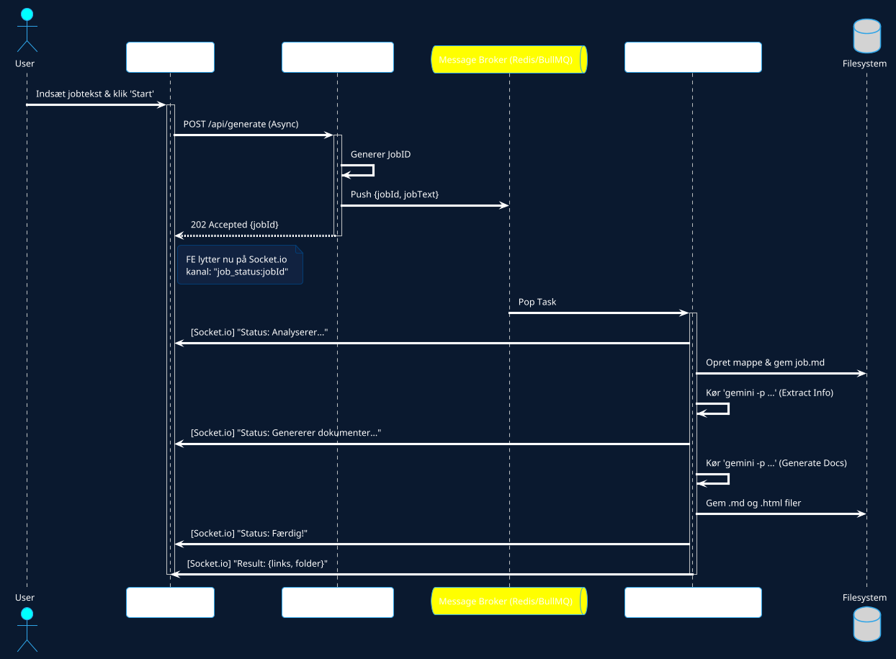

# Systemarkitektur: Job Application Agent v2.0

Denne dokumentation beskriver overgangen fra en monolitisk synkron arkitektur til en asynkron, event-drevet arkitektur ved hjælp af en **Message Broker**.

## 1. Designmål
- **Responsiv UI**: Frontenden skal aldrig "fryse" eller vente på et HTTP-svar i mere end et par millisekunder.
- **Real-tids Feedback**: Brugeren skal kunne se fremskridt (f.eks. "Analyserer jobopslag", "Genererer CV", "Færdig").
- **Fejltolerance**: Hvis en opgave fejler, skal systemet kunne rapportere det uden at crashe hele forbindelsen.
- **Adskillelse af bekymringer (SoC)**: API'en modtager ordrer, Brokeren styrer køen, og Workeren udfører det hårde arbejde.

## 2. Komponenter

### Frontend (React + Socket.io)
Brugerfladen sender en "Job Request" via et WebSocket eller en hurtig REST-post og lytter derefter på en dedikeret kanal (`job_updates`) for statusmeddelelser.

### API Gateway (Express)
Modtager anmodningen, validerer den, genererer et unikt `jobId` og lægger en besked i køen (Message Broker). Den returnerer straks `jobId` til frontenden.

### Message Broker (Redis / BullMQ)
Fungerer som mellemmand. Den holder styr på opgaver, der venter, er i gang, eller er fejlet. I et lokalt miljø kan vi starte med en simpel **EventEmitter** eller **Redis** for maksimal stabilitet.

### Worker (Node.js)
En separat proces (eller tråd), der kun lytter på køen. Når den modtager en opgave, kalder den `gemini` CLI'en. Undervejs sender den statusopdateringer tilbage til Brokeren/Socket.io.

## 3. Arkitektur Diagram (PlantUML)

## 4. Hvorfor denne tilgang?

1. **Stabilitet**: Hvis Gemini CLI tager 60 sekunder, vil en normal browser-forbindelse ofte timeout. Med en broker er forbindelsen "fire-and-forget", og resultatet kommer, når det er klar.
2. **Skalering**: Du kan køre flere Workers på forskellige maskiner, hvis du vil, mens API'en stadig er den samme.
3. **Læring**: Dette mønster (Producer-Consumer) er fundamentet for næsten alle moderne cloud-systemer.

## 5. Implementationsplan
1. **Setup**: Installer `socket.io` og `bullmq` (hvis vi bruger Redis).
2. **Refaktorering**: Flyt CLI-logikken fra `server.js` til en `worker.js`.
3. **Bridge**: Opsæt Socket.io i `server.js` til at videresende beskeder fra Workeren til Frontenden.
