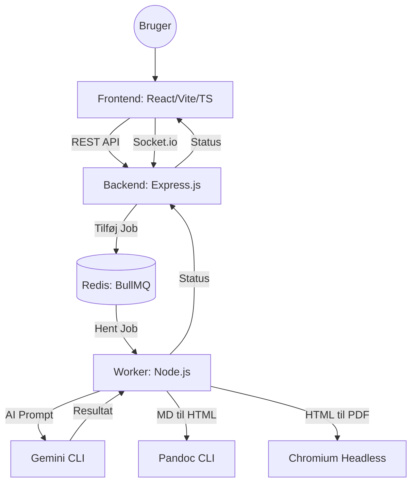

# Systemarkitektur: Job Application Agent (v2.4)

Dette dokument beskriver arkitekturen for den moderne web-baserede version af Job Application Agent, som findes i `demo/aka-torsdag` branchen.

## 🏗 Overordnet Arkitektur
Systemet er bygget som en moderne **Producer-Consumer** arkitektur, der sikrer en responsiv brugeroplevelse selv ved tunge AI-operationer.

## 🔍 Architecture Overview
1.  **Frontend (React/Vite):** En moderne, mørk-tema brugerflade, der styrer Master CV, job-input og viser resultater i realtid.
2.  **Backend (Express):** Håndterer API-anmodninger, serverer genererede filer og administrerer BullMQ-jobkøen.
3.  **Worker (Node.js):** Forbruger jobs fra køen, orkestrerer AI-kald til `gemini` CLI og håndterer filgenerering/konvertering.
4.  **Redis:** Rygraden i jobkøen og kommunikationen mellem processer.
5.  **Eksterne Værktøjer:** Systemet afhænger af `gemini` (AI), `pandoc` (Markdown til HTML) og `chromium` (HTML til PDF).

## 🧩 Komponenter

### 1. Frontend (React / Vite)
*   **Formål:** WYSIWYG editor til Master CV og jobopslag.
*   **Teknologier:** TypeScript, Tailwind CSS, Socket.io-client.
*   **Nøglefunktioner:**
    *   Live-editering af genereret Markdown.
    *   Realtidsvisning af PDF-previews via iFrame.
    *   Statusopdateringer fra Worker via Socket.io.

### 2. Backend (Express.js)
*   **Formål:** API Gateway og orkestrering.
*   **Teknologier:** Node.js, Express, BullMQ, Socket.io.
*   **Ansvarsområder:**
    *   Håndtering af Master CV (Læs/Skriv).
    *   Oprettelse af baggrundsjobs i BullMQ.
    *   Servering af statiske filer (PDF/HTML/MD) fra de genererede job-mapper.

### 3. Worker (Node.js)
*   **Formål:** Tungt arbejde (Heavy Lifting).
*   **Teknologier:** BullMQ, `child_process`, `dotenv`.
*   **Workflow:**
    1.  Modtager job-data (Jobtekst, URL, hints).
    2.  Identificerer sprog (DK/EN).
    3.  Udfører AI-prompter via `gemini` CLI.
    4.  Opdeler AI-svar i sektioner (Ansøgning, CV, Match, ICAN+).
    5.  Konverterer Markdown til HTML (Pandoc) og PDF (Chromium).
    6.  Udgiver resultater til filsystemet og opdaterer status via Socket.io.

### 4. Infrastruktur
*   **Redis:** Bruges som besked-broker for BullMQ.
*   **Docker Compose:** Orkestrerer 3 containere: `frontend`, `backend` og `redis`.
*   **Delt Volumen:** Backend og Worker deler adgang til rodmappen for at kunne læse/skrive job-filer.

## 🛠 Eksterne Værktøjer
Systemet er afhængigt af følgende CLI-værktøjer installeret i miljøet:
1.  **`gemini`**: Bruges til AI-generering og oversættelse.
2.  **`pandoc`**: Konverterer Markdown til ren HTML.
3.  **`chromium-browser`**: Genererer pixel-perfekte PDF'er fra HTML-skabeloner.

## 📂 Filstruktur & Oprydning (Planlagt)
For at holde projektet overskueligt flyttes skabeloner og demo-filer til dedikerede mapper:
*   `/templates/`: HTML-layout og base CSS.
*   `/resources/`: ICAN+ definitioner og reference-data.
*   `/demo/`: Tintin-specifikke filer og eksempler.
*   `/[timestamp]_.../`: Automatiske output-mapper for hver ansøgning.
